<p align="center">
  
</p>

<h1 align="center">🪐 Hi, I'm Orieb — welcome to my little purple galaxy ✨</h1>

<p align="center">
  <b>Senior Front-End · Full-Stack Web & Mobile Developer</b> · Amman, Jordan 🇯🇴<br/>
  Remote · Relocation · Full-Time · Part-Time · Per-Project / Freelance<br/>
  <sub>🤖 Next stop: <b>AI developer</b> — building with it, and building it.</sub><br/>
  <sub>💜 <b>Human-first, always.</b> Every screen, API and AI feature I build starts with the person using it.</sub><br/>
  <sub>Smile ☁️ ✨ 🐋 — that's the Orieb way.</sub>
</p>

<p align="center">
  <a href="mailto:alzuotorieb9999@gmail.com"></a>
  <a href="https://www.linkedin.com/in/orieb-alzyuot996"></a>
  <a href="./Orieb-Alzyuot-CV-2026.pdf"></a>
  <a href="tel:+962775853203"></a>
</p>

---

## 🌌 Mission log

Senior Front-End and Mid Full-Stack **Web & Mobile Developer** with **6+ years** of experience. I take complete ownership of end-to-end front-end projects, architectures and UI/UX implementations in **Angular, React and React Native**, and I build the services behind them with **Node.js, Express, .NET Core** and SQL/NoSQL databases (**PostgreSQL, MongoDB**), deployed on **Microsoft Azure**. Docker on every project, Figma/Adobe XD on the design side.

**Where I'm heading: AI.** I already ship with Claude and Cursor every day; my next chapter is building AI-powered products and agents myself.

**What never changes: the human.** Senior for me means the tech serves the person on the other side of the screen — clear flows, accessibility, Arabic/RTL that feels native, honest error states, and AI that helps instead of replaces. Focus on humans, all the time. 💜

```ts
const orieb = {
  callsign:     "oriieebgSmile96",
  role:         "Senior Front-End · Mid Full-Stack Web & Mobile Developer",
  experience:   "6+ years",
  base:         "Amman, Jordan 🇯🇴",
  availability: ["Remote", "Relocation", "Full-Time", "Part-Time", "Per-Project"],
  front:        ["Angular (expert, all versions)", "React", "Next.js", "React Native"],
  back:         ["Node.js", "Express", ".NET Core", "PostgreSQL", "MongoDB", "REST", "Microservices"],
  cloud:        ["Microsoft Azure", "Docker", "CI/CD"],
  ai:           ["Claude", "Cursor", "Claude Code"],
  nextStop:     "AI Developer 🤖 — agents, LLM apps, AI-first UX",
  focus:        "Humans, all the time 💜 — accessible, RTL-native, honest UX",
  mindset:      "Fish & whale 🐋 — start tiny, grow big",
  rule:         "Forget '5 min'. Open the editor. Write code.",
  always:       "Smile ☁️ ✨",
};
```

## 🚀 Current orbit — Saudi Azm (Azm Digital)

**Senior Front-End and Mid Full-Stack Developer · Nov 2023 – Present · Remote**

- Lead end-to-end front-end architecture for large-scale enterprise **web and mobile** apps, integrating UI/UX from Figma and Adobe XD.
- Spearhead migrations of legacy apps to the latest **Angular (v21/v22)** with Signals for performance and maintainability.
- **Dockerized** front-end projects for consistent local dev and CI/CD pipelines.
- Build and scale backend microservices in **.NET Core**, deployed and managed on **Microsoft Azure**.
- Design and optimize **RESTful APIs, Node.js microservices** and **SQL/PostgreSQL** integrations for heavy data transactions.
- Ship cross-platform mobile features with **React Native**, sharing business logic between web and mobile.
- Technical reviews and sprint planning in Jira, with **Claude / Cursor** for AI-assisted development.

Platforms I've worked on: 🏛️ [Saudi Bar Association — complaints QC](https://qccx.sba.gov.sa/) · ⚖️ Ministry of Justice (<bdi>وزارة العدل</bdi>) · 🧭 Mirafh · 🏗️ [Saudi Engineering Arbitration Center](https://web01.techprocess.net:28059)

## 🛰️ Previous orbit — Tahaluf Al Emarat Technical Solutions

**Front-End Web Developer · Jun 2023 – Nov 2023 · Amman, Jordan**

- Developed key modules for **low-code / no-code business automation platforms** using **Angular 16** and **PrimeNG**.
- Optimized application performance and resolved UI integration bugs, **reducing load times**.
- Reported PrimeNG bugs upstream along the way (see the open-source radar below).

## 🛰️ Previous orbit — Shepherd Technologies

**Front-End Web Developer · Nov 2021 – Jun 2023 · Amman, Jordan**

- Developed responsive SPAs for **Human Capital Management** suites (**Payroll & Performance** modules) using **Angular** and REST APIs.
- Refactored legacy front-end codebases to improve maintainability and system performance.

## 🛰️ Previous orbit — PenguinIN

**Full-Stack Web Developer · Nov 2020 – Nov 2021 · Amman, Jordan**

- Built **indoor-navigation CMS** products using **Node.js, React, OpenLayers** and **PostgreSQL** backend services.
- First full-stack mission: owned both the map-heavy React front-end and the Node/PostgreSQL API behind it.

## 🧰 Toolkit on board

**Frameworks & Web**
<p>
  
  
  
  
  
  
  
</p>

**Languages**
<p>
  
  
  
  
  
  
  
</p>

**Cloud, Data & Tools**
<p>
  
  
  
  
  
  
  
  
  
</p>

## 🤖 Next orbit — AI

Full-stack today, **AI developer tomorrow**. I'm learning by building: LLM-powered features inside real apps, agents that do the boring work, and AI-first UX (chat, copilots, smart forms). In the lab: Claude Code, Cursor, Anthropic & OpenAI APIs, RAG, prompt engineering, Python.

<p>
  
  
  
  
  
</p>

## ⏱️ The 5-minute rule (the Orieb way)

> **Forget "just 5 minutes."** Open the editor, write code, and the next hour takes care of itself.

That's the whole idea behind [**5min**](https://github.com/oriieebgSmile96/5min): small, daily, shipped. Fish-and-whale mindset 🐋 — start tiny, grow big, and **smile** while you do it.

## 🐛 Open-source radar — bugs I found in the wild

When a library breaks in production, I don't just work around it — I report it upstream with a reproducer so the next dev doesn't hit the same wall.

| Library | Report | What happened | Status |
| --- | --- | --- | --- |
| 📄 **Mozilla pdf.js** (`pdfjs-dist` 5.4) | [#20306](https://github.com/mozilla/pdf.js/issues/20306) | After upgrading, PDFs stopped rendering on iPhone 15 Pro (Safari/Chrome) while iPhone 11 worked — caught the device-specific regression on mobile. | ✅ Closed / resolved |
| 🎨 **PrimeNG** (Angular 16) | [#13468](https://github.com/primefaces/primeng/issues/13468) | `ContextMenu` items could no longer be swapped at right-click time after the new `processedItems` internals — the old `model` override silently stopped working. | ✅ Closed / resolved |
| 🎨 **PrimeNG** | [#13479](https://github.com/primefaces/primeng/issues/13479) | `Dialog` / `DynamicDialog` drag broke when the cursor crossed into the body — the drag handle disappeared mid-drag. | ✅ Closed / resolved |
| 🎨 **PrimeNG** | [#13506](https://github.com/primefaces/primeng/issues/13506) | `Dropdown` virtual scroll is front-end only — proposed server-side lazy loading (page index / size on scroll-to-end). | ✅ Closed |
| 🅰️ **yangular** | [#61](https://github.com/yantrab/yangular/issues/61) | Requested an upgrade to current Angular versions. | 🟣 Open |

Plus dozens of merged PRs on production Angular / .NET / React Native codebases — RTL fixes, SignalR, OTP flows, Expo mobile parity, admin dashboards.

## 📡 Telemetry

<p align="center">
  
  
</p>

## 🎓 Launch pad — Al-Balqa Applied University

**B.Sc. Communication & Software Engineering · 2014 – 2018 · Amman, Jordan**

- GPA **3.58 / 4.00** · **Ranked 2nd in class** 🥈

## 🎓 Launch pad — Hack Reactor curriculum

**Full Stack Web Development Intensive · Mar – Aug 2020**

- 12-week immersive program: JavaScript, Node.js, React, data structures, full-stack projects.

## 📜 Certifications

**Verified LinkedIn skill certifications**

- Angular · React.js · Node.js · JavaScript · TypeScript · Git · Agile Methodologies

---

<p align="center">
  <b>Smile ☁️ ✨ 🐋</b><br/>
  <sub>Stay shining — you promised. Stay happy, live your life, and ship it. 💫</sub>
</p>
